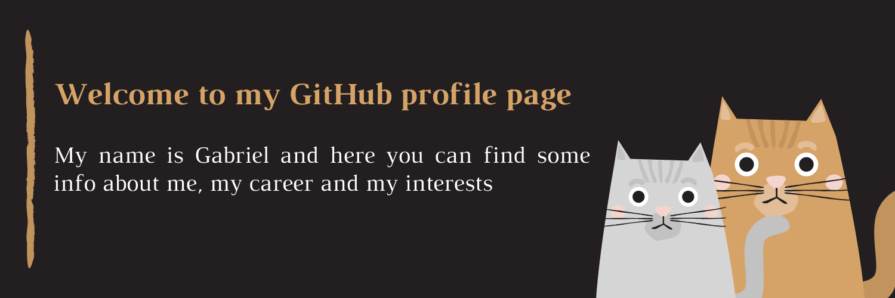

😄 *Pronouns: he/him* \
:mortar_board: *Information Systems student at <a href="https://www5.usp.br/">University of São Paulo</a>* \
:computer: *Software Developer at <a href="https://www.sintesejr.com.br/">Síntese jr.</a>*

###📫 How to reach me:

 \
 \

### Technologies that I usually work with

### Some other technologies that I've studied

### Here are some info about my github page

<!--
**gmichelassi/gmichelassi** is a ✨ _special_ ✨ repository because its `README.md` (this file) appears on your GitHub profile.

Here are some ideas to get you started:

- 🔭 I’m currently working on ...
- 🌱 I’m currently learning ...
- 👯 I’m looking to collaborate on ...
- 🤔 I’m looking for help with ...
- 💬 Ask me about ...
- 📫 How to reach me: ...
- 😄 Pronouns: ...
- ⚡ Fun fact: ...
-->
